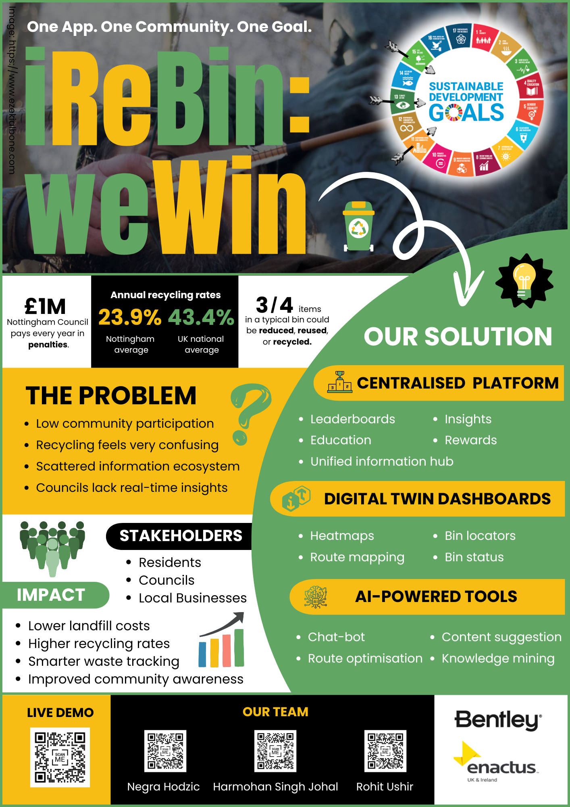

# 🌱 iReBin, weWin

**Nottingham's Smart Recycling Community Platform**

> *"When I recycle, we all win!"* - Building sustainable communities through gamified recycling and digital twin technology.

---

## 🌍 Overview

**iReBin, weWin** is an innovative recycling solution designed to increase community responsibility across Nottingham through engaging leaderboards, educational content, and neighborhood goal-setting. Our platform combines the power of **Bentley iTwin Platform** with community gamification to transform waste management into an engaging, data-driven experience.

### 🎯 Mission
Promote active participation in household recycling through incentives, educational resources, and community-based rewards while reducing waste management inefficiencies through digital twin technology.

---

## ✨ Key Features

### 🏆 Community Leaderboards
- **Neighborhood competitions** across 47+ Nottingham areas
- **Real-time rankings** with live progress tracking
- **Monthly challenges** and community goals
- **Achievement badges** and recognition system

### 📚 Educational Hub
- **Interactive learning modules** on recycling best practices
- **Nottingham-specific** recycling guidelines
- **Gamified quizzes** with point rewards
- **Progress tracking** and skill development

### 🎮 Gamification System
- **Points and rewards** for proper recycling behavior
- **Level progression** and community status
- **Collective achievements** benefiting entire neighborhoods
- **Real-world incentives** (council tax discounts, vouchers)

### 🗺️ Digital Twin Integration
- **Bentley iTwin Platform** for 3D bin visualization
- **Real-time monitoring** of bin fill levels
- **Route optimization** for waste collection
- **Spatial analytics** for community insights

### 👥 Dual User Experience
- **Citizen Dashboard**: Personal stats, rewards, and community engagement
- **Admin Portal**: Council management, analytics, and route planning

---

## 🌍 Making Nottingham Greener, Together

*iReBin, weWin* isn't just a platform—it's a movement. Every recycled item, every point earned, and every neighborhood goal achieved brings us closer to a sustainable future for Nottingham.

**Join the community. Make a difference. When you recycle, we all win! 🌱**

---

**[🚀 Live Demo](https://irebin.vercel.app)**

Made with 💚 in Nottingham

